# Architecture Overview

Rusty Socks v0.2.0 uses a multithreaded architecture built around a custom **ThreadPool**, with fully asynchronous task management and no `block_on` in the request path. This design avoids runtime stalls and aligns with the improvements identified in the 2026 security and architecture audit.

## Flow from Warp Filters to WebSocket Handler

```mermaid
flowchart LR
    subgraph warp [Warp filters]
        Path[warp.path]
        Ws[warp.ws]
        Headers[headers_cloned]
        CSRF[csrf_validation_filter]
        Addr[remote addr]
    end
    subgraph logic [Connection logic]
        ExtractIP[extract_client_ip]
        CanConnect[can_ip_connect]
        RegisterIP[register_ip_connection]
        ExtractToken[extract_token_comprehensive]
        Upgrade[on_upgrade]
    end
    subgraph pool [Thread pool]
        Execute[thread_pool.execute]
        HandleClient[handle_ws_client]
    end
    Path --> Ws --> Headers --> CSRF --> Addr
    Addr --> ExtractIP --> CanConnect --> RegisterIP --> ExtractToken --> Upgrade
    Upgrade --> Execute --> HandleClient
```

Request processing order: path and WebSocket upgrade → headers → CSRF validation → client IP extraction → IP rate-limit check → IP registration → token extraction → upgrade callback → task submitted to the thread pool → `handle_ws_client` runs on the pool.

## Multithreaded Architecture and Custom ThreadPool

The server does not run WebSocket handlers on the main Tokio runtime. Instead, a dedicated **ThreadPool** (`core::thread_pool`) runs a separate multi-threaded Tokio runtime used only for handling client connections. This isolates connection workload and provides built-in DoS protections.

### ThreadPool Construction

The pool is built from `ServerConfig` via `ThreadPool::from_config(config)` (or `ThreadPool::new(worker_count, max_queued_tasks)`). In `src/core/thread_pool.rs`:

- **Runtime**: `tokio::runtime::Builder::new_multi_thread()` with:
  - `worker_threads(actual_workers)` — `actual_workers` is `worker_count.max(2)` (minimum 2 threads).
  - `enable_io()` and `enable_time()`.
  - `thread_name("rusty-socks-worker")`.
- **Limits**:
  - `max_queued_tasks`: cap on how many tasks can be in flight (default 1000 from `DEFAULT_MAX_QUEUED_TASKS`).
  - Task submission rate: at most `(actual_workers * 100).min(1000)` tasks per second; excess submissions are rejected.

### Executing Work on the Pool

`ThreadPool::execute<F>(&self, future: F) -> Option<JoinHandle<F::Output>>` where `F: Future + Send + 'static`, `F::Output: Send + 'static`:

1. Checks the per-second task rate limit; if exceeded, returns `None`.
2. Checks that the current number of active tasks is below `max_queued_tasks`; if not, returns `None`.
3. Increments the active-task count, spawns the future on the pool’s runtime via `runtime.spawn(...)`, and wraps it so the count is decremented when the task completes.
4. Returns `Some(handle)` immediately. The caller does **not** await the handle in the request path.

In `src/bin/server.rs`, the WebSocket route calls `thread_pool.execute(handle_ws_client(...))`. If the result is `None` (rate limit or capacity), the connection is rejected and `unregister_ip_connection(client_ip)` is invoked so the IP slot is released.

## Async Task Management and Moving Away from block_on

The 2026 audit highlighted that blocking the runtime (e.g. with `block_on`) in an async context can stall the entire executor and degrade latency and throughput. Rusty Socks v0.2.0 removes all such blocking from the request path.

### Pure async/await on the Request Path

- **Entry point**: The binary uses `#[tokio::main]`, so the main runtime is async.
- **Upgrade callback**: After the Warp filters run (CSRF, IP rate limit, IP registration, token extraction), `ws.on_upgrade(move |socket| { ... })` is used. Inside the callback:
  - `handle_ws_client(socket, ...)` is passed to `thread_pool.execute(...)`.
  - The callback returns `async {}` — a future that completes immediately. The runtime does **not** wait for the WebSocket connection to finish; it only waits for the upgrade future to resolve.
- **No block_on in production path**: A search of the codebase shows `block_on` only in test code (e.g. `src/core/thread_pool.rs` tests, `tests/websocket_test.rs`). No production path blocks the runtime.

### Why This Matters

- The main Tokio runtime stays responsive for accepting new connections and running other filters.
- Heavy or long-lived WebSocket work runs on the pool’s runtime, with its own thread count and task limits.
- Rejections (rate limit, full pool) are handled without blocking: the server returns an error (e.g. 429) and releases the IP slot when the pool refuses the task.

Together, the custom ThreadPool and the strict avoidance of `block_on` in the request path form the basis of the v0.2.0 architecture and meet the 2026 audit’s guidance on async design and runtime stalls.
