# Architecture Overview

If you're new to the codebase, this page is your map. We'll walk through how requests flow from the wire to the WebSocket handler, why we use a custom thread pool, and why we went all-in on async (no `block_on`). Everything here reflects choices we made for v0.2.0, including the 2026 security and architecture audit.

## Flow from Warp Filters to WebSocket Handler

```mermaid
flowchart LR
    subgraph warp [Warp filters]
        Path[warp.path]
        Ws[warp.ws]
        Headers[headers_cloned]
        CSRF[csrf_validation_filter]
        Addr[remote addr]
    end
    subgraph logic [Connection logic]
        ExtractIP[extract_client_ip]
        CanConnect[can_ip_connect]
        RegisterIP[register_ip_connection]
        ExtractToken[extract_token_comprehensive]
        Upgrade[on_upgrade]
    end
    subgraph pool [Thread pool]
        Execute[thread_pool.execute]
        HandleClient[handle_ws_client]
    end
    Path --> Ws --> Headers --> CSRF --> Addr
    Addr --> ExtractIP --> CanConnect --> RegisterIP --> ExtractToken --> Upgrade
    Upgrade --> Execute --> HandleClient
```

Here's the path a WebSocket connection takes before your handler sees it:

In plain English: we match the path and WebSocket upgrade, grab headers, run CSRF validation, figure out the client IP, check and reserve an IP slot, extract the auth token, then hand the upgraded socket to the thread pool. You'll find it useful to keep this order in mind when debugging—if something fails, you'll know which layer said no.

## Why a Custom Thread Pool?

We chose **not** to run WebSocket handlers on the main Tokio runtime. Instead, a dedicated **ThreadPool** in `core::thread_pool` runs its own multi-threaded Tokio runtime just for client connections. That gives us two things: isolation (so a burst of connections doesn't starve the rest of the server) and built-in DoS protections (task count and rate limits). When you're scaling up, you can tune the pool size and queue depth without touching the main runtime.

### How the Pool Is Built

The pool comes from `ServerConfig` via `ThreadPool::from_config(config)`. Under the hood we use `tokio::runtime::Builder::new_multi_thread()` with at least two worker threads (we clamp `worker_count` to a minimum of 2 so you don't accidentally run with one and create a bottleneck). We enable I/O and time drivers and name the threads `"rusty-socks-worker"` so they're easy to spot in a profiler. Be careful with `max_queued_tasks`: it defaults to 1000; if you set it too low, you'll see connections rejected under normal load. We also cap how many tasks we *accept* per second (derived from worker count, up to 1000/sec) so a single client can't flood the queue.

### What Happens When You Execute

`ThreadPool::execute(future)` does three things: it checks the per-second rate limit, checks that we're under `max_queued_tasks`, then spawns your future on the pool's runtime and returns a `JoinHandle` (or `None` if we had to reject). The important part: **we never await that handle in the request path**. So the Warp filter returns immediately after submitting the task; the connection is handled in the background. If `execute` returns `None`, we reject the connection and call `unregister_ip_connection` so we don't leak the IP slot. You'll find this pattern in `src/bin/server.rs` right around the WebSocket upgrade callback.

## Async All the Way: Why We Kicked block_on Out

> **Developer Insight**  
> The 2026 audit flagged a classic pitfall: using `block_on` (or any blocking call) inside an async context. It can stall the entire executor and kill latency and throughput. So we made a rule: **no `block_on` in the request path.** You'll only see it in tests (e.g. `thread_pool.rs` and `websocket_test.rs`) where we need to drive a future to completion in a synchronous test. In production, the request path is pure async/await.

Here's how that plays out. The binary uses `#[tokio::main]`, so the main runtime is async. When we're inside the WebSocket upgrade callback, we call `thread_pool.execute(handle_ws_client(...))` and then return `async {}`—a future that completes right away. The runtime doesn't wait for the WebSocket to close; it only waits for that empty future. So the main runtime stays free to accept new connections and run other filters, while the heavy, long-lived work runs on the pool with its own limits. When we have to reject (rate limit or full pool), we do it without blocking and we still release the IP slot. That's the behavior the 2026 audit asked for, and it's the basis of our v0.2.0 architecture.
